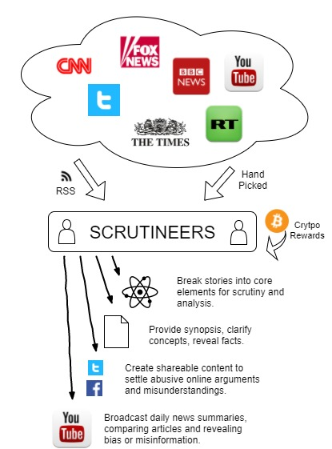
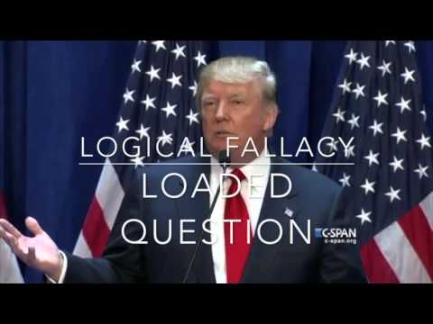

# Intro
Introduction to ScrutiNews on Github

## What is ScrutiNews?
ScruitiNews is crowd scrutiny, giving people tools and methodologies to scrutinise online content, fuelled by a cryptocurrency micro-payments token. Applying crowd scruitiny to 'news' is the major application.

This is a proposed project to change the way we read and discuss the daily news events.  Many of us will browse our favourite news websites every day, encounter news posts from friends on social media, or tune into the daily news on TV and radio. We like keeping abreast of current events. Many of us also comment on news items online, or discuss events in the news at work or when socialising.

But there's a growing awareness that news can be 'faked' or distorted, we don't know what news to trust, and ensuing discussions and debate soon descend into slurs and abuse.

The basic idea behind ScrutiNews is to encourage those people who take great interest in news events, to become paid 'Scrutineers', applying analysis and fact checking to news stories using a thorough methodology, so that readers know how much they can trust a story, as well as understanding the range of alternative viewpoints.

## How can I find out more or get involved?
<a href="https://github.com/ScrutiNews/proposal/blob/master/ScrutiNewsProposal-v1.0.1.pdf"></a>
* **Firstly, Read the [High-level Proposal](https://github.com/ScrutiNews/proposal/blob/master/README.md) !!**
* Developers, supporters or anyone interested in the idea can join the [Slack Workgroup](https://join.slack.com/t/scrutinews/shared_invite/enQtMzI0MTk4MjY0MjEzLTVlNTBkYTg0ZjdlYTcxZTBkY2I0ZmNlNGU5MzE4ZjhkODE1ZDgxMTViYzUxMWU3MTk4MDBkNTQ2YjVjYTRlNTY) (Spammers and idiots will be thrown out)
* As a developer you could follow repos in the [Scrutinews Github Project](https://github.com/ScrutiNews) or ask `@John Durrant` via [Slack](https://join.slack.com/t/scrutinews/shared_invite/enQtMzI0MTk4MjY0MjEzLTVlNTBkYTg0ZjdlYTcxZTBkY2I0ZmNlNGU5MzE4ZjhkODE1ZDgxMTViYzUxMWU3MTk4MDBkNTQ2YjVjYTRlNTY) to be included on the team.
* Anyone wanting to actively get stuck into the project, helping to define and implement the platform, can ask `@John Durrant` via the [Slack](https://join.slack.com/t/scrutinews/shared_invite/enQtMzI0MTk4MjY0MjEzLTVlNTBkYTg0ZjdlYTcxZTBkY2I0ZmNlNGU5MzE4ZjhkODE1ZDgxMTViYzUxMWU3MTk4MDBkNTQ2YjVjYTRlNTY) for an invite to the [ScrutiNews Trello Board](https://trello.com/scrutinews)
* As someone who wants to take a side interest and see updates as the project grows, join the [ScrutiNews Facebook Page](https://www.facebook.com/scrutinews)

## What is the proposed development and launch process for ScrutiNews?

### 1. Build a Project Rewards Tool
A mini open source project using an token on the [Ethereum Blockchain Platform](https://www.ethereum.org/) to track people's input into the main project. This will be a chance for developers to work and play with Ethereum and get used to working with Smart Contracts. The idea is that as people contribute to the main project, they will issue invoices for their work and be paid in tokens, creating a secure, transparent and immutable record of inputs on the Ethereum Blockchain. The tokens could be traded for future 'shares' in the main project. See [Project Rewards Tool](https://github.com/ScrutiNews/proposal/blob/master/appendix-I-project-rewards-tool.md) 

### 2. Build a cryptocurrency news aggregator as a prototype
Build the main platform, as defined in the [Proposal](https://github.com/ScrutiNews/proposal/blob/master/README.md). Contributions will be recorded using the Project Rewards Tool mentioned in (1). Further detail is in [Section 3.3](https://github.com/ScrutiNews/proposal/blob/master/project-description.md#33-cryptoassets---initial-use-case-for-the-scrutinews-platform) of the proposal. The challenge here will be co-ordinating a collaborative development team, project definition and management etc. 

### 3. Continually evolve the Scrutiny Methodology
This whole project rests on developing tools and knowledge for objectively scrutinising content. A suite of tools and learning resources will be needed to support this activity. These resources will be needed to create the kind of scrutiny described in [Section 4.3](https://github.com/ScrutiNews/proposal/blob/master/how-platform-and-features.md#43-scrutineers) of the proposal. The methodology will help identify [abuses of argumentation strategy](https://en.wikipedia.org/wiki/List_of_fallacies) and recognising where [cognitive bias](https://en.wikipedia.org/wiki/List_of_cognitive_biases) may be be a factor. 

The above video, by [TeachArgument](http://teachargument.com), showing Donald Trump using 15 logical fallacies in 3 minutes of speech, is a good intro to the desired analysis on ScrutiNews.

### 4. Launch an ICO (Initial Coin Offering)
The purpose of the ICO, as described in [Section 8.1](https://github.com/ScrutiNews/proposal/blob/master/business-considerations.md#81-funding-and-proposed-ico) of the main proposal, will be to create the cryptocurrency micro-payments token as the currency used to generate revenues and reward 'Scrutineers', the people using the platform to filter and scrutinise news feeds. The ICO will also provide for an allocation of funds to reward those who have been contributing and building the platform, according to their share of tokens accumulated with the Project Rewards Tool (1) above.

### 5. Launch the full product covering mass media topic
Moving from the prototype to a product with mainstream appeal will require continual refinement and product maturation. This will require continual product tweaking, community building and plenty of patience. It will also require testing and fine tuning of the business model to ensure that the mainstream product is commercially viable. 

### 6. Curated news broadcasts via YouTube/Podcasts
People want their daily news delivered in accessible chunks, easy to navigate, filtered and scrutinised to assess truthfulness and reliability. This needs to be well presented, engaging and enlightening. The aim will be for people get their news from our curated video/podcasts rather than through traditional mainstream news channels. Put simply, the goal is to 'Tell the Truth'... 

## Thoughts, unknowns, and questions about this project:
* This is clearly an ambitious project with many difficulties to overcome, let's take a step-by-step approach. This section will be used as a kind of FAQ area as people raise questions or concerns about the project.
* Everything here is a work-in-progress, sketching out an idea and a rough plan, critique and constructive feedback is welecome.

## Thank You!
*"Thanks for taking interest in this little project. Tackling the lies, propaganda, distortions and prejudice in everyday news is a noble cause, and one that I hope will motivate people to get involved. I don't know exactly where support will come from and how big it will be, but I know it will be needed to make this crazy idea a reality. Thanks for taking a look and I hope the sentiments expressed here will encourage your participation..."* -  John Durrant, February 2018.
